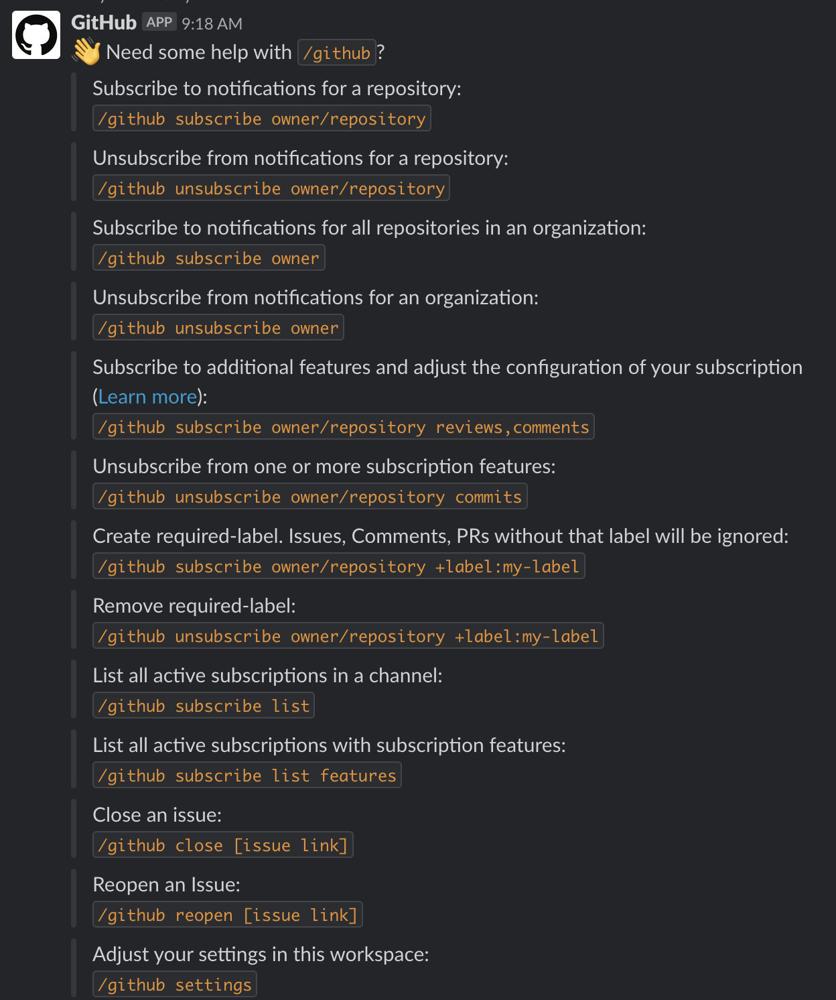
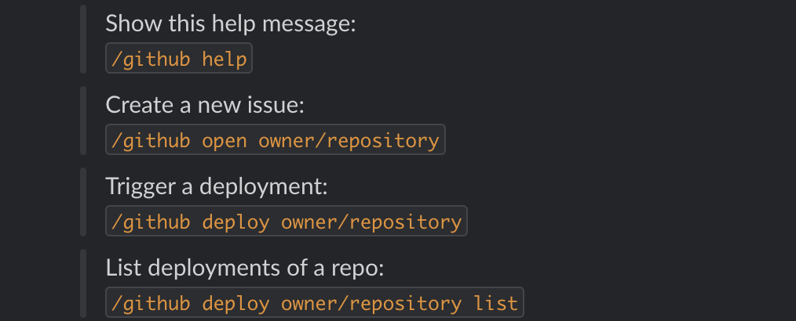

# Tool Research - 심화편
## 부제 - More about "Slack"

## 최초작성일 : 2019.12.02

<h2>1. Intro </h2>

>도대체 무슨 기능 때문에 사람들이 그렇게 Slack을 쓰는지 궁금하다. `왜 하필 Slack일까?` 도대체 무슨 기능이 있길래 사람들이 그렇게 Slack을 사용하는걸까? 이번에는 그걸 한번 알아봤다. 이번에도 저번과 마찬가지로 내가 직접 써보고 어떤 기능들이 있나 한번 알아보고 작성했으니, 천천히 살펴보자.

<h2>2. Dancing with Github</h2>

> 
> Slack은 개발자든 아니든 많은 사람들이 이용한다. 그리고 Git은 세계에서 개발자가 가장 많이 사용하는 툴이다. 그런데 이런 Slack이 Github을 App으로 지원한다니, 정말 말도 안되게 칭찬한다.
> 
> 그렇다면 Slack에서 어떤 기능들을 지원하는지 한번 살펴보자.

1. Slack에서 연동되는 Github 기능 - 기능리스트
	>
	>