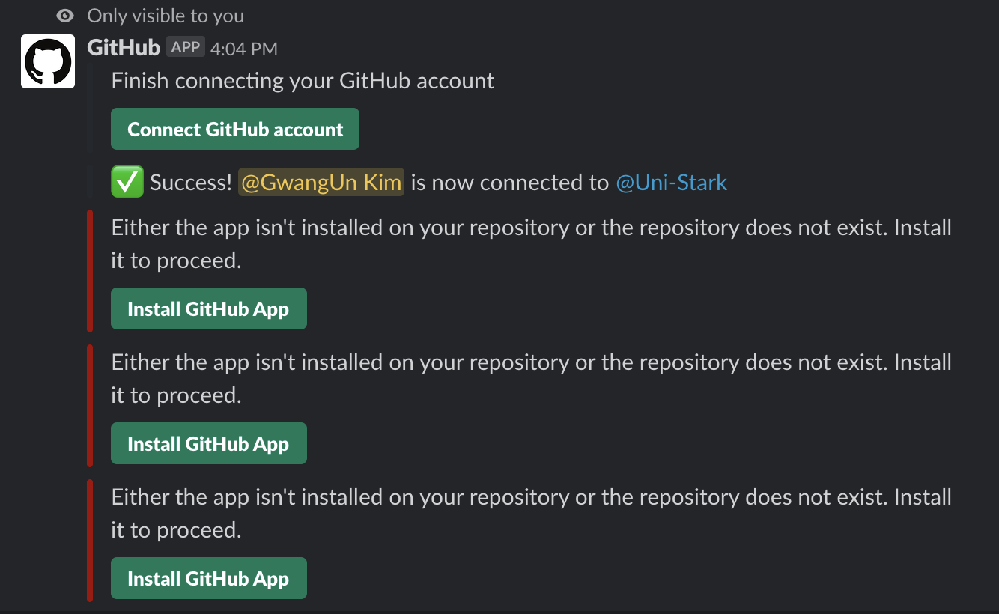

# Tool Research - 심화편
## 부제 - More about "Slack"

## 최초작성일 : 2019.12.02

<h2>1. Intro </h2>

>도대체 무슨 기능 때문에 사람들이 그렇게 Slack을 쓰는지 궁금하다. `왜 하필 Slack일까?` 도대체 무슨 기능이 있길래 사람들이 그렇게 Slack을 사용하는걸까? 이번에는 그걸 한번 알아봤다. 이번에도 저번과 마찬가지로 내가 직접 써보고 어떤 기능들이 있나 한번 알아보고 작성했으니, 천천히 살펴보자.

<h2>2. Dancing with Github</h2>

>  
> Slack은 개발자든 아니든 많은 사람들이 이용한다. 그리고 Git은 세계에서 개발자가 가장 많이 사용하는 툴이다. 그런데 이런 Slack이 Github을 App으로 지원한다니, 정말 말도 안되게 칭찬한다. 
>  
> 그렇다면 Slack에서 어떤 기능들을 지원하는지 한번 살펴보자.

1. subscribe
	>Github의 User나 repository의 소식들을 받아보기 위해서는 우선적으로 subscribe를 해줘야 한다. 무작정 Slack에다가 Github만 Install해주면, Slack은 어떤 정보를 보내줄지 모르기 때문이다.
	>~~~
	>/github subscribe Uni-Stark/toolresearch.git
	>~~~
	>이런식으로 명령어를 Slack에 입력해주면 아래 사진과 같은 화면이 뜨면서 Slack과 Github의 특정 repository가 연동이 되었다고 뜬다. 물론 특정 repo뿐만 아니라 User만 subscribe해주어도 된다. 그렇게 된다면 해당 User가 모든 repo에 올리는 모든 것들이 Slack으로 올 수 있기 때문에, 주의해야 한다.
	>
	>
	>
	>
	>
	>
	>