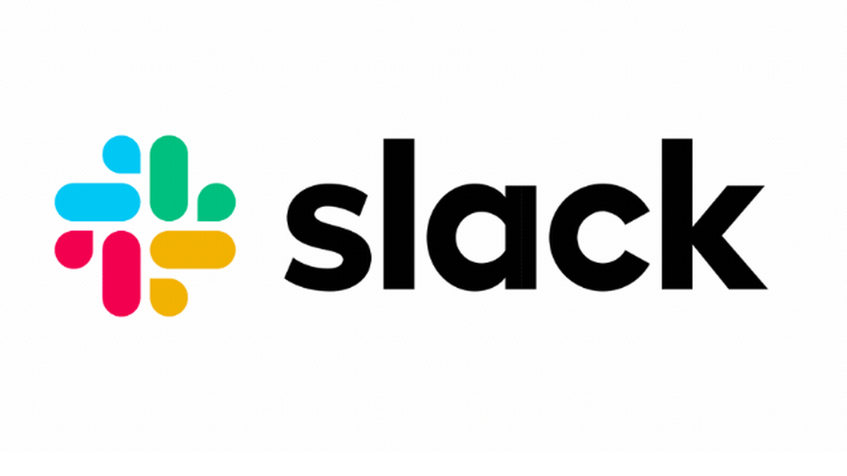
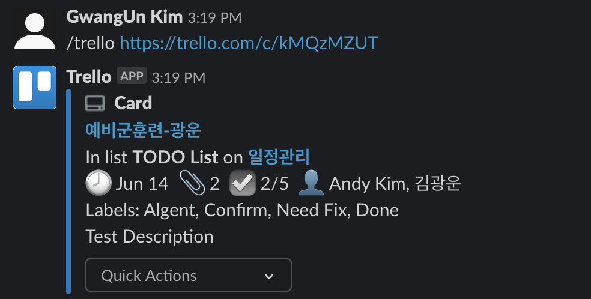

# Tool Research - 심화편
## 부제 - More about "Slack"

## 최초작성일 : 2019.12.02

<h2>1. Intro </h2>

>도대체 무슨 기능 때문에 사람들이 그렇게 Slack을 쓰는지 궁금하다. `왜 하필 Slack일까?` 도대체 무슨 기능이 있길래 사람들이 그렇게 Slack을 사용하는걸까? 이번에는 그걸 한번 알아봤다. 이번에도 저번과 마찬가지로 내가 직접 써보고 어떤 기능들이 있나 한번 알아보고 작성했으니, 천천히 살펴보자.

<h2>2. Slack (feat. Github)</h2>

> Slack은 개발자든 아니든 많은 사람들이 이용한다. 그리고 Git은 세계에서 개발자가 가장 많이 사용하는 툴이다. 그런데 이런 Slack이 Github을 App으로 지원한다니, 정말 말도 안되게 칭찬한다. 그렇다면 Slack에서 어떤 기능들을 지원하는지 한번 살펴보자.
  
>   

1. subscribe
	>`Github의 User나 repository의 소식들을 받아보기 위해서는 우선적으로 subscribe`를 해줘야 한다. 무작정 Slack에다가 Github만 Install해주면, Slack은 어떤 정보를 보내줄지 모르기 때문이다.
	>~~~
	>/github subscribe User-name/specific-repo.git
	>/github subscribe Uni-Stark/toolresearch.git (예시)
	>~~~
	>

	>이런식으로 명령어를 Slack에 입력해주면 위 사진과 같은 화면이 뜨면서 Slack과 Github의 특정 repository가 연동이 되었다고 뜬다. 물론 특정 repo뿐만 아니라 User만 subscribe 해주어도 된다. 그렇게 된다면 해당 User가 모든 repo에 올리는 모든 것들이 Slack으로 올 수 있기 때문에, 주의해야 한다. 그리고 실제로 subscribe하고 있는 repo에 commit이 올라오면 아래 사진처럼, 어떤 branch에 어떤 message를 commit 했는지 확인할 수 있다.  
	>
	> 

2. issue
 	> 
	>Slack에서는 위 사진과 같이, 올라오는 issue를 알람으로 친절하게 알려준다. 몇 번째 이슈가 어떤 내용인지 친절하게 알려준다.
	>~~~
	>/github close https://github.com/Uni-Stark/toolresearch/issues/1
	>/github reopen https://github.com/Uni-Stark/toolresearch/issues/1
	>~~~
	>또한 위와 같은 명령어를 쳐서 간단하게 issue를 close, repoen 할 수 있으며, 아래 사진과 같이 해당 이슈에 대한 close, reopen의 status를 전달받을 수 있다.  
	>  
	>  
	>그리고 이러한 issue에 대한 handling은 아래 사진과 같이 Github에 전부 반영되어 있다.  
	>

<h2>3. Slack(feat.trello) </h2>

> `프로젝트를 진행하는데, 일정관리는 땔래야 땔 수 없는 필수적인 요건`이다. 그리고 팀원들간의 커뮤니케이션도 놓칠 수 없는 부분이다. 그래서 Slack에서는 trello를 연동될 수 있게 해놓았다. 정말 Slack 개발자들 칭찬해~ 
>  
> 사실 2번에서 설명한 Github 연동 관련된 것들은 수월하게 진행했다. 이미 내가 Github를 많은 부분에서 잘 사용하기 때문이다. 그래서 issue, repository와 같은 용어들이 친숙하게 느껴져서 쉽고 간단하게 할 수 있었다. 하지만! trello는 아직까지도 난관이다. `나도 아직 trello의 모든 기능을 제대로 모르고 일단 해보자! 라는 식`이지만, 최대한 `내가 할 수 있는 한도내에서` Slack에서 제공하는 trello가 가지는 기능들을 살펴 보았다. Let's go~

1. Slack에서 Board 보기
	>Slack은 많은 부분을 명령어를 통하여 간단하게 trello를 조작할 수 있게 만들어 두었다.
	>~~~ 
	>/trello link [Address of trello board or card]
	>/trello add [teammate]|[card name]
	>~~~
	>이런식으로 말이다. 그래서 간단한 명령어로도 trello에 들어가지 않아도 slack에서 board나 card의 상태를 확인할 수 있다. 아래 사진처럼 말이다.  
	> 

2. Slack에서 Board나 Card link 하기
	>이미 위에 1번에서 명령어를 보여줬지만, 다시한번 언급하면 /trello link 라는 명령어를 통해 특정 보드나 카드를 slack에서 연동할 수 있다. 이렇게 연동되면 trello에서 생기는 변동사항이나, teammate가 보거나, 원하는 문자를 해당 board에 있나 검색할 수 있게된다. 물론 연동이 되어있는 부분만 가능하다. 
	> 
	>위 사진과 같이 연동을해서 slack을 사용하는 유저가 Default List를 설정할 수 있고, 사용자마다 누군가가 불러온 Slack에 대하여 Join, Subscribe, Star를 누를 수 있다. 그렇게 된다면, 모든 사람이 각자 주소를 불러올 필요없이 편하게 Link 할 수 있게 된다.

3. 그 외 기능
	> 많은 기능들을 제공하는데, teammate가 없어서 내가 못해서, 간략하게 글로 기능들을 소개하겠다.
	>  
	>위에서 부터 설명하면 소속된 `팀원들 중 특정 인물을 특정 카드에 소속되게 하는 기능`이 바로 assign 기능이다. 그리고 `특정 카드에 comment 명령어를 이용해 댓글`을 달 수 있고, 마지막으로 `set-due를 이용해 특정 카드의 데드라인`을 정할 수 있다. 간단하게 Slack 안에서 말이다!
	>> 내가 보기엔 slack은 약간 개발자 친화적인 커뮤니티 툴인 것 같다.